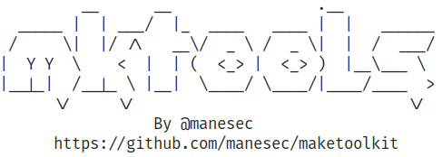

# maketoolkit

Quick to install some pen-testing tools on python3.10+ and debian.



# Warning

This is **BETA** version, which mean it need to very unstable.

## Install

```bash
git clone https://github.com/manesec/maketoolkit.git
cd maketoolkit ; chmod u+x install.sh; sudo ./install.sh
```

**Note**: All tools will be locate in `/var/lib/mkt/Tools/Source` which soft link to `/Tools`.

## Usage

```bash
mkt install Windows/WinPEAS
mkt search reverse cheat sheet
```

## Options

```bash
Usage:
    # Base install and uninstall tools.
    mkt   install     [<tools name>, <.mkt files>]
    mkt   uninstall    <tools name>
    mkt   reinstall    <tools name>
    mkt   upgrade      <tools name>
    mkt   upgrade      all

List:
    # List install the tools name.
    mkt   list     install
    mkt   list     installable

Script:
    # List build-in script
    mkt   script   list
    mkt   script   info
    # Run the script 
    mkt   script   <script_name>

DB and res:
    mkt   db   installable
    mkt   db   list
    mkt   db   install       <db_name>
    mkt   db   uninstall     <db_name>

Search DB and res:
    mkt   search   <string>

Other:
    # Update all the source include mkt.
    mkt-update

    # Remove all "__pycache__" in tools
    mkt clearup """)
```

## Collection Tools List

```bash
$ mkt list installable
[*] Installable Tools List:
    Binary/Ghidra
    Tools/JSPWebShellCollection
    Tools/NmapAutomator
    Tools/ReverseSSH
    Tools/Tools4mane
    Tools/HackBrowserData
    Tools/Webshells_BlackArch
    Tools/Chisel
    Windows/Gosecretsdump
    Windows/Boodhound
    Windows/Mimikatz
    Windows/Wesng
    Windows/WinPWN
    Windows/SharpCollection
    Windows/PrintSpoofer
    Windows/WinPEAS
    Windows/Powershell/Nishang
    Windows/Powershell/PSHTML
    Windows/Powershell/NetSPI
    Windows/Powershell/ADACLScanner
    Windows/Powershell/ADEssentials
    Windows/Powershell/ADPeas
    Windows/Powershell/AdsiPS
    Windows/Powershell/Sherlock
    Windows/Powershell/ADModule
    Windows/Powershell/PowerSploit_Master
    Windows/Powershell/VulnerableAD
    Windows/Powershell/BadBlood
    Windows/Powershell/RedTeamPowershellScripts
    Windows/Powershell/PowerShellSuite
    Windows/Powershell/RedTeamPowershellEnum
    Windows/Powershell/PowerSploit_Dev
    Windows/Powershell/Privesc
    Windows/Powershell/ADLab
    Windows/Powershell/PowerUpSQL
    Windows/Potato/RottenPotato
    Windows/Potato/RoguePotato
    Windows/Potato/Juicypotato
    Linux/Sudo_killer
    Linux/LinEnum
    Linux/LES2
    Linux/LinPEAS
    Linux/LES
    Linux/Pspy
    Wordlists/Rockyou
    Wordlists/SecLists
    Wordlists/AutoWordlists
    Wordlists/DOC
    Wordlists/Kkrypt0nn
```
