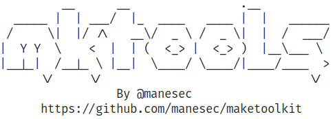

# maketoolkit

Quick to install some pen-testing tools on python and debian like os.



# Warning

This is **BETA** version, which mean it need to very unstable, if you find a bug just feel free to submit the issue. you need to update before to use.

## Install

```bash
git clone https://github.com/manesec/maketoolkit.git
cd maketoolkit; chmod u+x *.sh; sudo ./install.sh
```

**Note**: All tools will be locate in `/var/lib/mkt/Tools/Source` which soft link to `/Tools`.

## Structure

There are 3 main structure, `Tools` , `Search db` and `Script`.

`Tools` use to install the pen-test tools.

`Search DB` use to search local document. It mean you need to download search db before to use.

`Script` is some script, use to install some tools or setup the env.

## Update

Just type `sudo mkt-update` to update the tools, **But all tools will be delete it and reinstall the source**.

## Example

```bash
# ========== Tools ==========
# If you need to see what tools can be install: 
sudo mkt list installable

# Install the tools, just type tools name: 
sudo mkt install Windows/WinPEAS

# Or, goto /Tools/Linux and :
sudo mkt install LinPEAS.mkt

# ========== Search DB ==========
# What db can be installable: 
sudo mkt db installable

# (Recommend) If you want to support to view .md file, you need to:
sudo mkt script InstallGlow

# Before you need to search, you need to install search db.
sudo mkt db install HackTricks

# When it finish to install db just type :
mkt s reverse shell
# or
mkt search reverse shell

# ========== Script ==========
# List all the script
sudo mkt script list

# use the script
sudo mkt script <script_name> 

# ========== Other ==========
# Update mkt tools and the source just type:
# All the tools will be delete.
sudo mkt-update

# Enjoy it
```

## Usage

```bash
Usage:
    # Base install and uninstall tools.
    mkt   install     [<tools name>, <.mkt files>]
    mkt   uninstall    <tools name>
    mkt   reinstall    <tools name>
    mkt   upgrade      <tools name>
    mkt   upgrade      all

List:
    # List install the tools name.
    mkt   list     install
    mkt   list     installable

Script:
    # List build-in script
    mkt   script   list
    mkt   script   info
    # Run the script 
    mkt   script   <script_name>

DB and res:
    mkt   db   installable
    mkt   db   list
    mkt   db   install       <db_name>
    mkt   db   uninstall     <db_name>

Search DB and res:
    mkt   search   <string>

Other:
    # Update all the source include mkt.
    mkt-update

    # Remove all "__pycache__" in tools
    mkt clearup 
```

## Collection Tools List

```bash
$ sudo mkt list installable               
[*] Installable Tools List:
    Binary/Ghidra
    Linux/LES
    Linux/LES2
    Linux/LinEnum
    Linux/LinPEAS
    Linux/Pspy
    Linux/Sudo_killer
    Tools/ApacheDirectoryStudio
    Tools/AutoRecon
    Tools/Chisel
    Tools/DDexec
    Tools/Deepce
    Tools/EyeWitness
    Tools/Gitjacker
    Tools/Godzilla
    Tools/GrepForOSINT
    Tools/HackBrowserData
    Tools/Htshells
    Tools/JSPWebShellCollection
    Tools/Legion
    Tools/LinkFinder
    Tools/NmapAutomator
    Tools/Rapidscan
    Tools/ReconScan
    Tools/ReverseSSH
    Tools/Tools4mane
    Tools/Webshells_BlackArch
    Tools/xc
    Windows/ADenum
    Windows/Boodhound
    Windows/Certipy
    Windows/Coercer
    Windows/DomainUsersToXLSX
    Windows/Gosecretsdump
    Windows/KaliWinBinary
    Windows/KrbCredExport
    Windows/Mimikatz
    Windows/Nullinux
    Windows/PHPReverseShell
    Windows/PKINITtools
    Windows/Potato/Juicypotato
    Windows/Potato/RoguePotato
    Windows/Potato/RottenPotato
    Windows/Powershell/ADACLScanner
    Windows/Powershell/ADEssentials
    Windows/Powershell/ADLab
    Windows/Powershell/ADModule
    Windows/Powershell/ADPeas
    Windows/Powershell/ADRecon
    Windows/Powershell/AdsiPS
    Windows/Powershell/BadBlood
    Windows/Powershell/NetSPI
    Windows/Powershell/Nishang
    Windows/Powershell/PSHTML
    Windows/Powershell/PowerShellSuite
    Windows/Powershell/PowerSploit_Dev
    Windows/Powershell/PowerSploit_Master
    Windows/Powershell/PowerUpSQL
    Windows/Powershell/Privesc
    Windows/Powershell/PrivescCheck
    Windows/Powershell/RedTeamPowershellEnum
    Windows/Powershell/RedTeamPowershellScripts
    Windows/Powershell/Sherlock
    Windows/Powershell/VulnerableAD
    Windows/Powershell/WinPWN
    Windows/PrintSpoofer
    Windows/Rev
    Windows/SharpCollection
    Windows/WCAM
    Windows/Wesng
    Windows/WinPEAS
    Wordlists/AutoWordlists
    Wordlists/DOC
    Wordlists/Kkrypt0nn
    Wordlists/Rockyou
    Wordlists/SecLists
```

## Search Document DB

```bash
$ sudo mkt db installable     
[*] List all installable db ...
    ADCheatsheet_S1ckB0y1337
    ADCheatsheet_drak3hft7
    ADExploitation
    AtomicRedTeam
    BaseDB
    Burmat
    Cheatsheet
    GTFOBin
    HackTricks
    IRedTeam
    KaliDocs
    LOLBAS
    MSRPCtoATTACK
    PWKCheatsheet
    PayloadsAllTheThings
    PentestBook
    PentestCheatSheets
    RedTeamWiki
    Ruuand
    TheHackerRecipes
    TheHackerTools
    Tools/BloodHound
    Tools/Mimikatz
    WADComs
    XapaxSecurity
```

## Script

```bash
$ sudo mkt script info
[*] Available scripts:
    InstallAllDB
    InstallBasicTools
    InstallGlow
    InstallNTH
    InstallRaccon
    SetupNeo4j
```

## Also Updating ...
